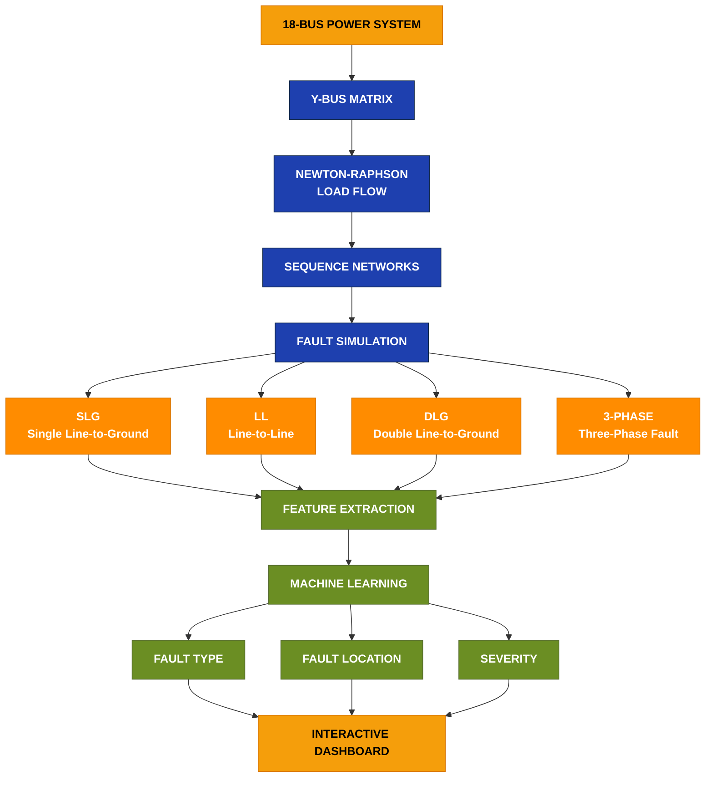
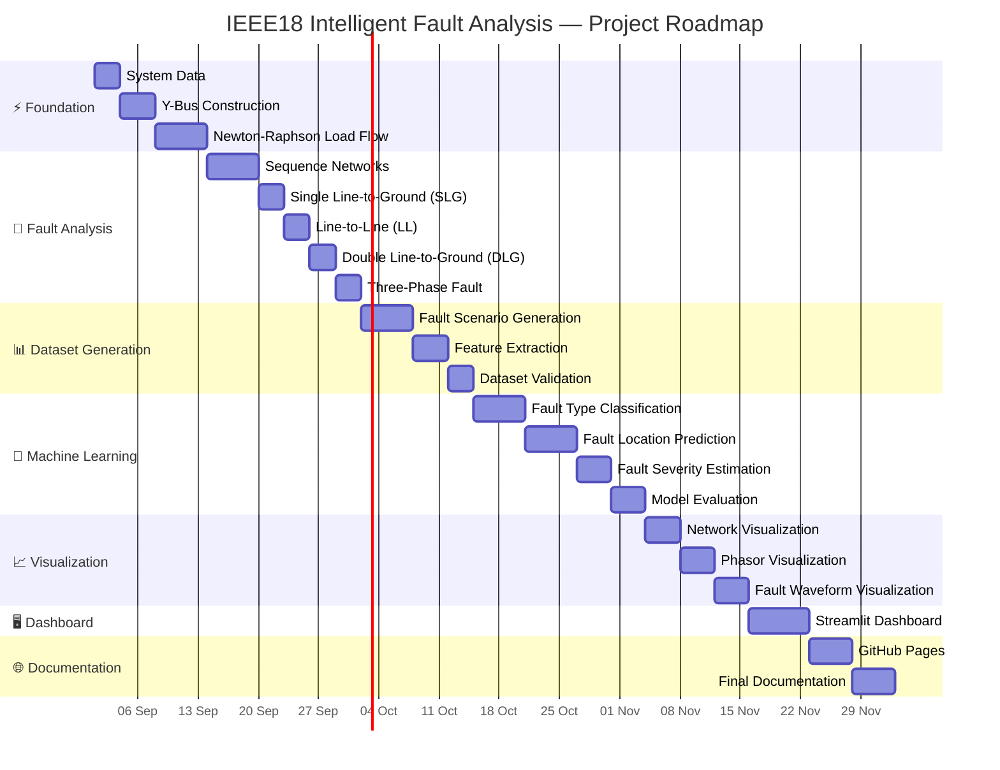

# ⚡ IEEE18 Intelligent Fault Analysis

A **Python-based intelligent power-system fault analysis platform** built around an 18-bus electrical network.

The project combines **power-system analysis, numerical computation, fault simulation, machine learning, and interactive visualization** into a single software-only platform.

> 🚫 **No hardware required.**
> The entire project is developed and simulated using Python.

---

## 🎯 Project Objective

The goal of this project is to develop a complete software platform capable of:

- Performing power-system load-flow analysis
- Modeling an 18-bus electrical network
- Constructing the bus admittance matrix (Y-bus)
- Solving power flow using the Newton-Raphson method
- Performing symmetrical-component analysis
- Simulating different types of electrical faults
- Automatically generating fault scenarios
- Extracting electrical features from simulated faults
- Classifying faults using machine-learning models
- Estimating fault location
- Assessing fault severity
- Visualizing system conditions and fault behavior
- Providing an interactive engineering dashboard

---

## 🏗️ Planned Architecture



---

## Project structure

```mermaid
flowchart LR
    A["⚡ IEEE18<br/>Intelligent Fault Analysis"]

    subgraph CORE["POWER SYSTEM CORE"]
        direction TB
        B["data/"]
        C["power_system/"]
        B1["system_data.py"]
        C1["ybus.py"]
        C2["load_flow.py"]
        C3["main.py"]

        B --> B1
        C --> C1
        C --> C2
        C --> C3
    end

    subgraph ANALYSIS["FAULT & DATA LAYER"]
        direction TB
        D["dataset/"]
        D1["Fault Dataset<br/>Generation"]

        E["Fault Analysis"]
        E1["SLG"]
        E2["LL"]
        E3["DLG"]
        E4["3-Phase"]

        D --> D1
        E --> E1
        E --> E2
        E --> E3
        E --> E4
    end

    subgraph AI["INTELLIGENCE LAYER"]
        direction TB
        F["ml/"]
        F1["Feature Extraction"]
        F2["Fault Type"]
        F3["Fault Location"]
        F4["Severity"]

        F --> F1
        F1 --> F2
        F1 --> F3
        F1 --> F4
    end

    subgraph UI["VISUALIZATION & INTERFACE"]
        direction TB
        G["visualization/"]
        H["dashboard/"]
        I["results/"]

        G1["Plots & Phasors"]
        H1["Streamlit Dashboard"]
        I1["Simulation Results"]

        G --> G1
        H --> H1
        I --> I1
    end

    A --> CORE
    CORE --> ANALYSIS
    ANALYSIS --> AI
    AI --> UI

    J["tests/"]
    K["requirements.txt"]
    L["README.md"]

    A --> J
    A --> K
    A --> L

    classDef highlightStyle fill:#f59e0b,stroke:#d97706,color:#000,font-weight:bold
    classDef foundationStyle fill:#1e40af,stroke:#0c2340,color:#fff,font-weight:bold
    classDef faultStyle fill:#ff8c00,stroke:#d97706,color:#fff,font-weight:bold
    classDef processingStyle fill:#6b8e23,stroke:#556b2f,color:#fff,font-weight:bold

    class A,K,L highlightStyle
    class B,C,B1,C1,C2,C3,J foundationStyle
    class D,D1,E,E1,E2,E3,E4 faultStyle
    class F,F1,F2,F3,F4,G,H,I,G1,H1,I1 processingStyle
```



---

## 🚧 Development Status

### Stage 1 — Power-System Foundation

- [x] 18-bus system data
- [x] Line/network data
- [x] Generator data
- [x] Y-bus construction
- [x] Newton-Raphson load-flow solver
- [x] Convergence checking
- [x] Automated unit tests

### Stage 2 — Fault Analysis

- [ ] Positive-sequence network
- [ ] Negative-sequence network
- [ ] Zero-sequence network
- [ ] Single Line-to-Ground (SLG) fault
- [ ] Line-to-Line (LL) fault
- [ ] Double Line-to-Ground (DLG) fault
- [ ] Three-phase fault
- [ ] Variable fault impedance
- [ ] Fault analysis at all buses

### Stage 3 — Dataset Generation

- [ ] Automatic fault-scenario generation
- [ ] Variable fault locations
- [ ] Variable fault impedances
- [ ] Multiple operating conditions
- [ ] Feature extraction
- [ ] Dataset validation

### Stage 4 — Machine Learning

- [ ] Fault/no-fault detection
- [ ] Fault-type classification
- [ ] Faulted-bus classification
- [ ] Fault-severity estimation
- [ ] Model comparison
- [ ] Model evaluation and explainability

### Stage 5 — Visualization & Dashboard

- [ ] Bus-voltage visualization
- [ ] Fault-current visualization
- [ ] Three-phase waveforms
- [ ] Phasor visualization
- [ ] Network visualization
- [ ] Interactive Streamlit dashboard
- [ ] Automated fault reports

---

---

## 🧮 Stage 1 — Power-System Analysis

The first stage implements the fundamental numerical power-system calculations directly in Python.

### Y-Bus Construction

The bus admittance matrix is constructed from the transmission-line parameters using the network's π-model representation.

```text
                Y-BUS

       ┌─────────────────────┐
       │                     │
       │       Y₁₁ ... Y₁₈  │
       │       ⋮       ⋮     │
       │       Y₁₈ ... Y₁₈  │
       │                     │
       └─────────────────────┘
```

### Newton-Raphson Load Flow

The AC load-flow solver determines:

- Bus voltage magnitudes
- Bus voltage angles
- Active-power injections
- Reactive-power injections
- Convergence status
- Iteration count
- Maximum power mismatch

The solver supports:

- Slack bus
- PV buses
- PQ buses

---

## ⚡ Planned Fault Analysis

The fault-analysis engine will support the major symmetrical-component fault types:

### Single Line-to-Ground

```text
Phase A
   │
   │
  ─┴─ Fault
   │
 Ground
```

### Line-to-Line

```text
Phase A ───┐
           ├── Fault
Phase B ───┘
```

### Double Line-to-Ground

```text
Phase A ───┐
           │
Phase B ───┼── Fault
           │
         Ground
```

### Three-Phase Fault

```text
Phase A ───┐
Phase B ───┼── Fault
Phase C ───┘
```

Fault calculations will use the appropriate sequence networks and bus-dependent sequence impedances.

---

## 🤖 Machine Learning

After the electrical simulation engine is validated, simulated fault cases will be automatically converted into a machine-learning dataset.

Potential features include:

```text
Three-phase voltages
Three-phase currents
Positive-sequence quantities
Negative-sequence quantities
Zero-sequence quantities
RMS voltage
RMS current
Voltage imbalance
Current imbalance
Fault current
Fault impedance
Power-system operating conditions
```

Potential models:

- Logistic Regression
- Decision Tree
- Random Forest
- Support Vector Machine
- Gradient Boosting
- XGBoost
- Neural Network

Models will be evaluated using appropriate metrics rather than relying only on accuracy.

---

## 📊 Planned Intelligent Diagnosis

The final system is intended to produce results such as:

```text
================================================
           FAULT DIAGNOSIS REPORT
================================================

Fault Status       : FAULT DETECTED
Fault Type         : SLG
Affected Phase     : A
Faulted Bus        : 13

Fault Current      : 4.82 kA
Fault Impedance    : 0.10 pu

ML Prediction      : SLG
Model Confidence   : 98.1 %

Severity            : HIGH

================================================
```

---

## 🖥️ Technology Stack

### Programming Language

**Python**

### Numerical Computing

- NumPy
- SciPy

### Data Processing

- Pandas

### Visualization

- Matplotlib
- Plotly

### Machine Learning

- Scikit-learn
- XGBoost _(planned)_

### Dashboard

- Streamlit

### Testing

- Pytest

### Development

- Visual Studio Code
- Git
- GitHub

---

## 🚀 Installation

Clone the repository:

```bash
git clone https://github.com/Sree2011/IEEE18-Intelligent-Fault-Analysis.git
cd IEEE18-Intelligent-Fault-Analysis
```

Create a virtual environment:

### Windows

```powershell
python -m venv .venv
.venv\Scripts\activate
```

Install dependencies:

```bash
pip install -r requirements.txt
```

---

## ▶️ Running Stage 1

Run the power-system analysis:

```bash
python -m power_system.main
```

The program will:

1. Load the 18-bus system
2. Construct the Y-bus matrix
3. Run Newton-Raphson load flow
4. Check convergence
5. Display bus voltages and angles
6. Display calculated power injections

---

## 🧪 Running Tests

Run:

```bash
pytest
```

The test suite verifies the fundamental numerical components of the project.

---

## 📌 Design Philosophy

This project is intentionally being developed **without hardware**.

The objective is to build a software environment where electrical-system behavior can be:

```text
Mathematically Modeled
        ↓
Numerically Simulated
        ↓
Analyzed
        ↓
Automatically Diagnosed
        ↓
Visually Explained
```

The electrical-engineering calculations will be implemented explicitly wherever practical instead of treating a third-party power-system package as a black box.

External libraries may later be used for **independent validation and benchmarking**.

---

## 🔬 Validation Strategy

The project will be validated progressively.

### Electrical validation

Compare calculated quantities against:

- Analytical fault equations
- Independent implementations
- Known benchmark/reference results
- Cross-checks using established Python power-system tools where appropriate

### Machine-learning validation

Evaluate:

- Accuracy
- Precision
- Recall
- F1-score
- Confusion matrix
- Cross-validation performance

The objective is not simply to obtain a high accuracy number, but to determine whether the model produces **physically meaningful and reliable fault diagnoses**.

---

## 🗺️ Long-Term Roadmap



---

## ⚠️ Current Scope

The current network data is the **18-bus system used in the original development project**. It should not be assumed to be an official IEEE benchmark case unless independently verified.

The project architecture is designed so that verified benchmark systems can be added later.

---

## 👤 Author

**Sree Sai Nandini Gundraju**

Electrical Engineering / Power-System Analysis Project

---

## 📄 License

This project is licensed under the **MIT License**.

See [`LICENSE`](LICENSE) for details.

---

## Dataset Citation

The IEEE 18-bus test system used in this project is based on the standard IEEE 18-bus radial distribution system originally reported by Grady, Samotyj, and Noyola (1992). The line and load parameters used in this project were obtained from the reproduced IEEE 18-bus test-system data provided in Appendix A of Milovanović, Radosavljević, and Perović (2018).

### References

1. W. M. Grady, M. J. Samotyj, and A. H. Noyola, "The application of network objective functions for actively minimizing the impact of voltage harmonics in power systems," _IEEE Transactions on Power Delivery_, vol. 7, pp. 1379–1386, July 1992.

2. M. Milovanović, J. Radosavljević, B. Perović, and M. Dragičević, "A Decoupled Approach for Harmonic Power Flow in Radial Distribution Systems with Nonlinear Loads," _International Journal of Electrical Engineering and Computing_, vol. 2, no. 1, 2018.

The system data are specified on a 10 MVA, 12.5 kV base.

### Data Source

The IEEE 18-bus line and load parameters are given in **Appendix A, Table A.I** of the following paper:

[Milovanović et al. (2018) – IEEE 18-bus test system data](https://ijeec.etf.ues.rs.ba/index.php/ijeec/article/download/29/14/)

See [`docs/IEEE18_DATA_SOURCE.md`](docs/IEEE18_DATA_SOURCE.md)
for the complete data-source information and citation.

---

## ⭐ Project Vision

> **From power-system equations to intelligent fault diagnosis — entirely in Python.**
